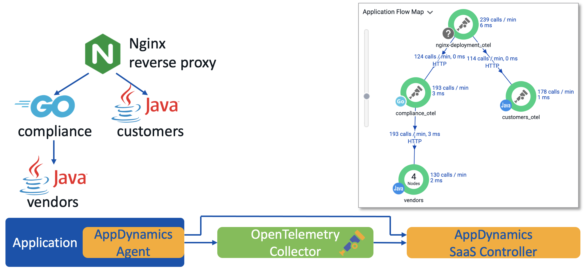
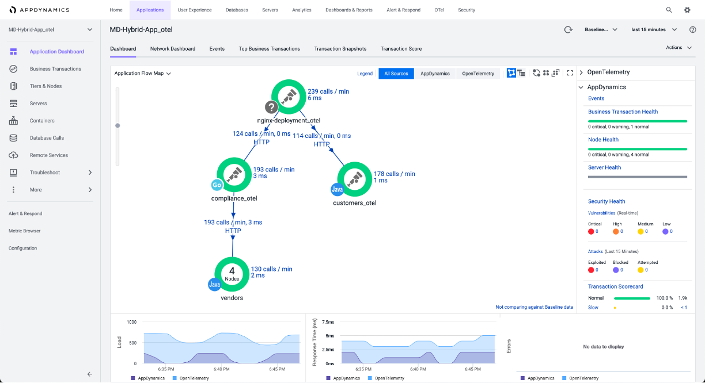
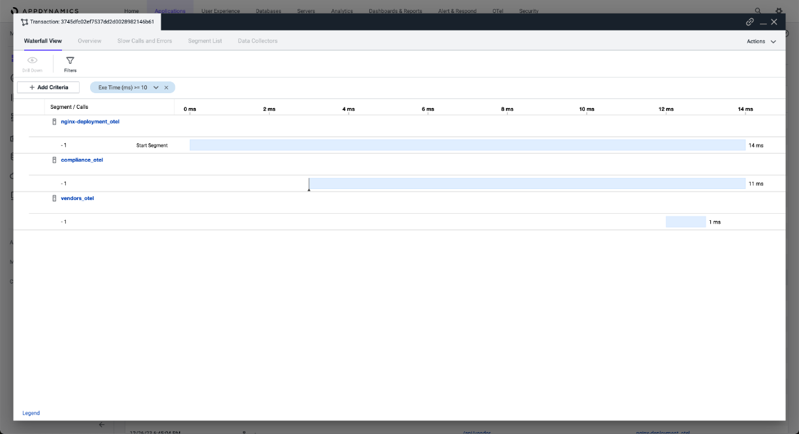
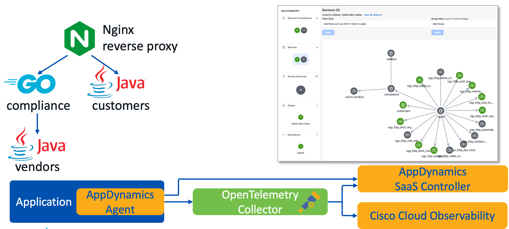
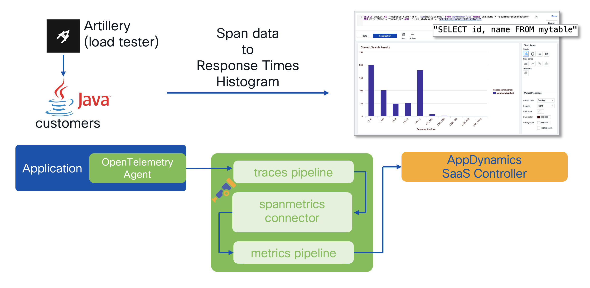
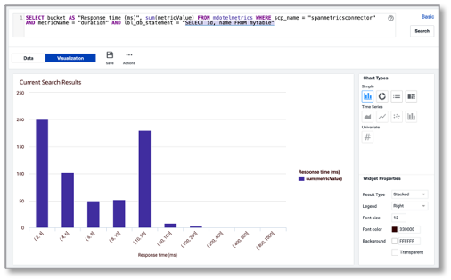

# Reference material for BRKAPP-2570 - OpenTelemetry and DevOps with Cisco AppDynamics & Full-Stack Observability

This repo contains guides, references, and other useful information as a suplement to a Cisco Live EMEA 2024 session BRKAPP-2570 - OpenTelemetry and DevOps with Cisco AppDynamics & Full-Stack Observability

It goes into step by step instructions for the three use cases presented, enabling an hands-on experience and getting insights how to use the concepts and features presented in other environments.

Prerequisites:

- access to a Kubernetes - all workloads are expected to run on Kubernetes
- access to an AppDynamics SaaS controller (1st and 3rd use cases, optional for 2nd use case)
- access to a Cisco Cloud Observability (2nd use case). Alternatively, also some other tracing backend like [Teletrace](https://github.com/teletrace/teletrace) can be used.
- Go compiler pre-installed (3rd use case, if you are not comfortable using pre-built images)

Before starting, clone this repository to your local computer by running 

`git clone https://github.com/chrlic/clemea24-brkapp-2570.git`

## Use Case 1 – Hybrid Telemetry Feed in AppD SaaS

In this use case, you'll learn how to use OpenTelemetry with AppDynamics SaaS solution. The typical motivation here iis to monitor something, what could not be monitored with AppDynamics SaaS itself. In this lab, you'll explore multiple use cases for that:

- **Nginx** monitoring - it is not possible to get tracing information with AppDynamics SaaS natively
- **Go**-based program - while there is an AppDynamics Go SDK for instrumentation, it's use is not straightforward and it is dependent on an AppDynamics C/C++ SDK library, which makes it limited in terms of computing platforms.
- **Java**-based program - wait - Java has very extensive support in AppDynamics. So why to use OpenTelemetry here? It's a) a technology example, how to do it, b) there are some libraries pre-instrumented with OTel and it's easy to work with, c) for custom communication protocols, it might be an easier choice. Let's be open and at least know it's there.

Following is a diagram of what we're going to achieve. We are also going to use both instrumentation mechanisms.

Prepare Auto-instrumentation at your Kubernetes. In this use case, two options are going to be used - [Cisco open source tool](https://developer.cisco.com/codeexchange/github/repo/cisco-open/appdynamics-k8s-webhook-instrumentor/) and [OpenTelemetry Kubernetes Operator](https://github.com/open-telemetry/opentelemetry-operator). Again, this is not necessary in practice, but let's see how both options work, to make our choice in future sound.

#### Deploy Cisco open source instrumentation tool

Add helm repository to your Helm installation

~~~
helm repo add mwh https://cisco-open.github.io/appdynamics-k8s-webhook-instrumentor/
helm repo update
~~~

Prepare a values file for the Helm chart. This contains information like your AppDynamics tenant identification, authentication information, OpenTelemetry collector configuration, and instrumentation rules, which specify which workloads to instrument, how, and where to get naming information for AppDynamics from.

Go to a `use-case-1-appd` directory of this repo.

The example values.yaml file for the Helm chart is located in the `mwh-values` subdirectory. Fill in values indicated by `<placeholders>` with your AppDynamics tenant information and credentials.

Review the section `appdController:` - supply the host, tenant, and credentials information for your controller and proxy information if you need to use proxy to reach the controller from the agents. For OpenTelemetry, supply the endpoint URL and authentication key - this information can be found on the OTEL tab in the controller.

Next, review the section `openTelemetryCollectors:` and OpenTelemetry collector definition `deployment-hybrid-agent-default:` - there is nothing needing a change, but see how the collector configuration looks like.

And last, review the sections `instrumentationTemplates` and `instrumentationRules` - here is defined instrumentation strategy and customizations for different languages and situations.

Create namespace for the instrumentation tool:

`kubectl create namespace mwh`

Run Helm chart with the values file:

`helm install --namespace mwh mwh mwh/webhook-instrumentor --values=mwh-values/values.yaml`

The application manifests then refer to the rules by setting up appropriate labels or annotations on the pod level - see examples in `d-svc-nginx.yaml` and `d-svc-vendors.yaml`. 

#### Working with native OpenTelemetry autoinstrumentation and agents

First verify, that you have cert manager running in your cluster - it's running usually in the `kube-system` namespace. If not, install it by running:

~~~
helm repo add jetstack https://charts.jetstack.io
helm repo update
helm install cert-manager jetstack/cert-manager --namespace cert-manager \
  --create-namespace --version v1.13.3 --set installCRDs=true
~~~

Next, deploy the OpenTelemetry Operator by running:

~~~
helm repo add open-telemetry https://open-telemetry.github.io/opentelemetry-helm-charts
helm repo update
helm install --namespace opentelemetry-operator-system \
  opentelemetry-operator open-telemetry/opentelemetry-operator
~~~

Instrumentation rules and OpenTelemetry infrastructure is then configured by custom CRDs:

The CRD 

~~~
apiVersion: opentelemetry.io/v1alpha1
kind: OpenTelemetryCollector
~~~

defines OpenTelemetry collector configuration - the collector can be run standalone in namespace as a deployment, deamon set, and or as a sidecar in an application pod. There's also the collector image and full configuration of the collector defined in this CRD. Operator then takes care about it's deployment.

The CRD

~~~
apiVersion: opentelemetry.io/v1alpha1
kind: Instrumentation
~~~

then defines the specific rules for instrumentation, usually bound to a specific language.

Application then refers to the `Instrumentation` CRD by pod annotations.

See `d-svc-customers.yaml` for an example.

#### Running the application and testing it

Create namespace `demo`

~~~
kubectl create namespace demo
~~~

Deploy the application by running

~~~
kubectl -ndemo apply -f .
~~~

Verify, that the application is running, look into logfiles (`kubectl -ndemo logs <pod-name>`) to verify, that the instrumentation worked.

Expose the Nginx port and run some transactions against the application. Just note, it may take like 30 seconds for the application components to start up. Following are URLs to try:

~~~
/api/customer/<number>/order/<number>
/api/vendor/<number>/pn/<number>
~~~

The application should respond each time that it has received such a request, nothing fancy. It's just a demo, after all.

Go to AppDynamics GUI, and verify, that the application was created and that it also created it's 'shadow' application with _otel suffix. Getting OTel data can take a bit longer, than the native data feed from agents. 

You should see something like this:

Explore, how flowmap changes when pressing "AppDynamics" and "OpenTelemetry" buttons on the flowmap. Explore business transactions.

Switch over to the 'shadow' _otel application view. Explore business transactions here. Now you see, why the shadow application view is handy!

Also, look at snapshots for _otel application. There's the waterfall view with traces across the application components, like this:

Once done, clean up the workloads:

`kubectl -ndemo delete -f .`

## Use Case 2 – Migration to Cisco Cloud Observability

In this use case, application and it's instrumentation stays the same, but you'll add another exporter to the OpenTelemetry collector configuration in order to share distributed tracing information to another observability solution, Cisco Cloud Observability (CCO) in our case.

Essentially, you'll achieve this:

Switch to the directory `use-case-2-appd-cco`.

For the Cisco open source tool, parameters and authentication infromation must be added to the `values.yaml` file - see the section `ciscoCloudObservability:`. The values can be copied from the helm chart values files provided by Cisco Cloud Observability, when deploying the monitoring of a Kubernetes cluster. 

Also, in the OpenTelemetry collector configuration, exported is added into the pipeline for the CCO.

For OpenTelemetry instrumentation, adjustments have to be done in the `OpenTelemetryCollector` CRD manifest - see the example in the `d-svc-customers.yaml` file. Again, main difference is an addition of the exporter, authentication information and pipeline configuration.

When you'd deploy the application from the use case 1 at this stage and run some transactions against it, you'd see, that the services are available only for **vendors** and **customers**. However, when searching for the traces, those will contain also traces from **Nginx** and **compliance**. Why is that?

For CCO to map traces and services to pods (and underlying infrastructure), there has to exist some binding information in the traces, which uniquely identify maps the traces to containers and pods. For this, the resource attribute `container_id` is used, which should be picked up by all instrumentations for any language. But, in reality, this is not the case. The manifests and values.yaml for Helm already include a workaround, so that the mapping  of traces to infrastructure is complete. 

More on this here: [Using OpenTelemetry Webserver Modules with AppDynamics Cloud](https://gist.github.com/chrlic/2168707b5afeaa0f77c0f4adf8c09985)

In our case, similar issue manifests with the Go application, similar workaround also included in the `d-svc-compliance.yaml` manifest.

Please note, that the application and instrumentation itself did not change a bit. 

This way, we can use several observability tools in parallel, sharing the same consistent data. Isn't that nice?

So deploy the application: `kubectl -ndemo apply -f .`

Wait about 30 seconds, expose the Nginx service port, for example: `kubectl -ndemo port-forward service/nginx 8765:8765` and run the same requests as in use case 1 agains that service.

Now, go to CCO, and from the screen with all different entities bubbles, navigate to Kubernetes, then select your Kubernetes cluster, select your namespace, click services.

You should see a service dependency chart, similar to the application flowmap in the use case 1. Also, since the traces are still being sent to AppDynamics SaaS, you can see it there, too.

In CCO, on the chart, select Nginx and then click the button Related Traces. List of traces should appear, select some and see the transaction flow and the flame chart on the bottom of the screen.

Click on individual spans and see, what attributes are displayed on the right.

Once done, clean up the workloads again: `kubectl -ndemo delete -f .`

## Use Case 3 – Using OpenTelemetry to Get More Insights (Load Testing and Result Analysis – Tale of Misleading Metrics)

Switch to the directory `use-case-3-appd-load-test/histogram-sql`.

The third use case shows, that OpenTelemetry brings a lot of creative possibilities. 

With one customer of mine, we were looking for a way to better analyze response times of certain transaction as a whole and at some significant points in it's processing, while running performance stress tests. Metric averages and means looked great, but we felt there are some outliers and we wanted more information. Baselining did not help much - test was too short for baseline to tell something meaningful, and when logging all traces, it was hard to sift through (hundreds of thousands transactions), especially where we focused on specific parts of the code.

The way we approached it was using the OpenTelemetry collector capabilities, in our case, collector component, which on one side takes traces from the application, on the other side publishes metrics - histograms with number of spans falling into a response time intervals, exported each minute, so we could correlate the performance with stress test phases. 

So what we ended up with, was similar to this:

The OpenTelemetry collector is configured with **spanmetrics** connector, which mainly specifies the response time intervals for histogram, and which attributes to use for distinguishing the spans for analysis. 

See the manifest for `OpenTelemetryCollector` in `d-svc-customer.yaml` for the collector's configuration - the **spanmetrics** connector is and exporter in the **traces** pipeline, and in the same time, receiver in the **metrics** pipeline. So it consumes traces and spans, does the math, and exports metrics as a result.

Also, the image for the collector is different - as you can see, custom collector image is used. Because there must be a way to visualize and analyze the information coming from metrics, the data has to be sent to an observability tool. It could be Prometheus or some other solution, but here is demonstrated, how to send the resulting metrics to AppDynamics. 

Note the **appdynamics** exporter - experimental (at this stage, but tested in real production) exporter capable of sending metrics and logs into Analytics table of choice. 

If you're interested in using it, see [this repo](https://github.com/chrlic/clemea24-devnet-1606) for instructions.

Now, when you deploy the application: `kubectl -ndemo apply -f d-svc-customers.yaml`

Wait about 30 seconds for the application to start, and then submit a performance test job, based on artillery.io: `kubectl -ndemo apply -f j-artillery.yaml`

And wait, until the job finishes. BTW, artillery.io is really useful.

When done, go to AppDynamics SaaS, to the Analytics page. 

Now, you can run Search on the table specified in the **appdynamics** exporter configuration, for example this:

`SELECT bucket AS "Response time (ms)", sum(metricValue) AS "Number of Requests" FROM mdotelmetrics WHERE scp_name = "spanmetricsconnector" and metricName = "duration" and lbl_db_statement = "SELECT id, name FROM mytable"`

and visualize it as a columnar chart. There should appear a chart like this:

On the X-axis, there are individual buckets, on the Y-axis, number of the spans with time duration falling into the time interval. And it works for any span reported to the OTel collector. Pretty useful, isn't it?

Congratulation, if you made it here and let us know, what you think in the Discussions of this repo.